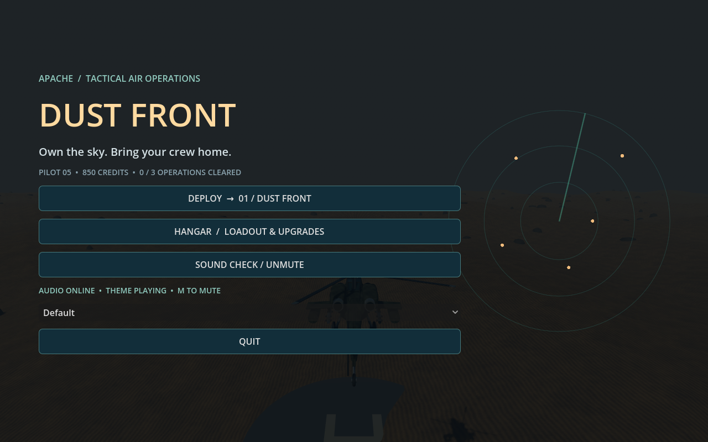
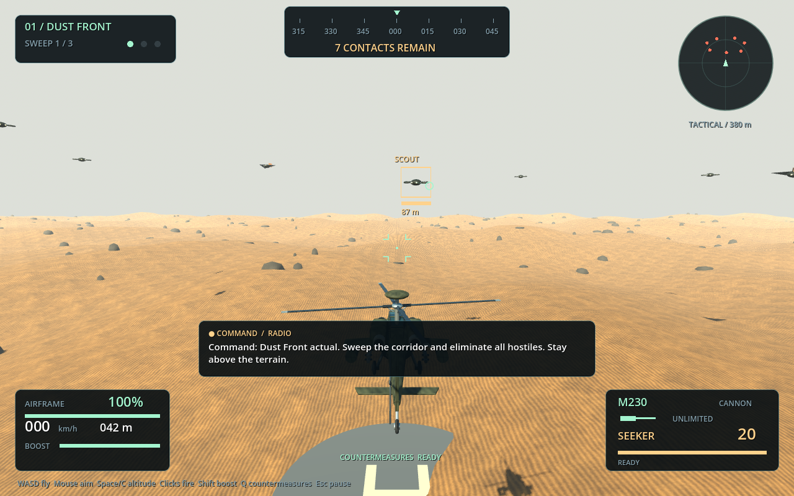
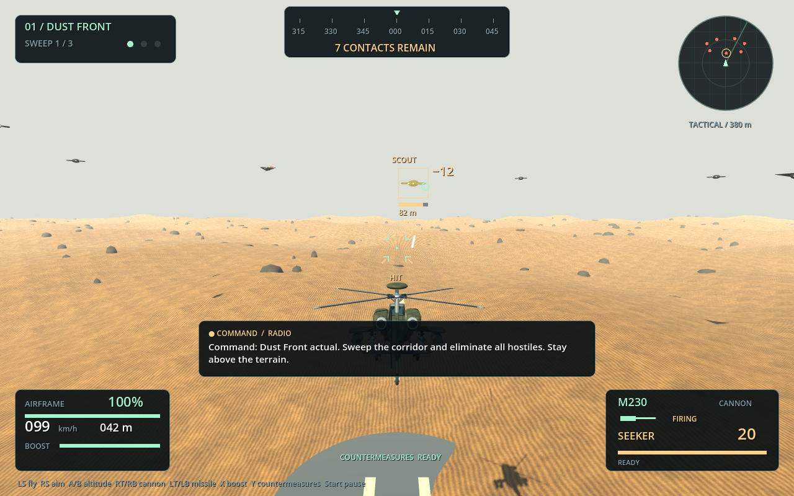
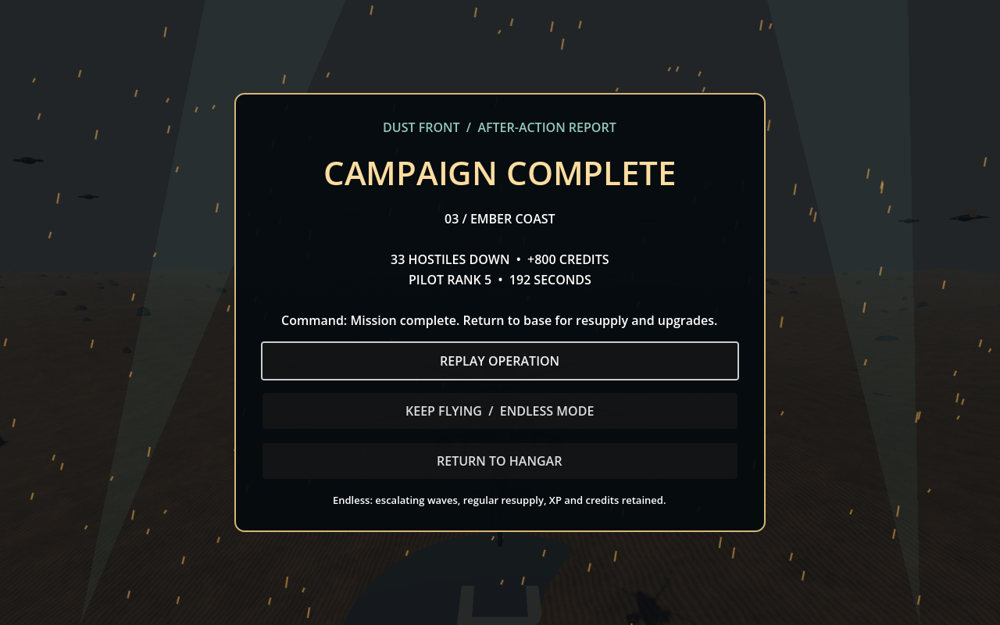

# Apache / Dust Front

A single-player arcade helicopter combat prototype for Godot 4.7.2, now with a persistent three-mission campaign.

Dust Front is a third-person Apache combat game built around short sorties, target locks, loadouts, upgrades, radio direction, and an endless mode after the campaign.

## Highlights

- Three large theaters: Dust Front, White Ridge, and Ember Coast.
- Four enemy types with interception, circling, spacing, burst fire, and ace encounters.
- Three primary cannons, three secondary weapons, missile ammo, upgrades, XP, credits, and mission unlocks.
- Controller support with automatic detection, remappable feel settings, boost, and countermeasures.
- Original menu theme, victory cue, radio briefings, radio subtitles, cannon feedback, explosions, radar sweep, and target lead prediction.

## Play

The start menu selects your latest unlocked operation, shows pilot progress, and opens the hangar. The original electronic title theme loops in menus and fades out during flight; adjust it with the Music slider in Hangar → Audio. Sound Check restores audible in-game levels, unmutes, and plays the commander. The title screen shows mute status and offers the audio outputs exposed by Godot. If your headset is not listed, select it in the system sound settings.

Open `project.godot` in Godot and press **F6** with `main.tscn` open, or **F5** to run the project. Click **Launch Sortie**.

- **W / S:** forward / reverse
- **A / D:** strafe
- **Mouse:** turn and aim vertically
- **Space / C:** climb / descend
- **Left mouse:** cannon
- **Right mouse:** equipped secondary weapon (cooldown and ammunition depend on loadout)
- Aim near a hostile drone to acquire a turret/rocket target lock.
- **Esc:** pause and release mouse
- **R:** restart
- **M:** mute
- **Shift:** rechargeable speed boost
- **Q:** defensive countermeasure burst; removes hostile shots within 100 m, with a 12-second cooldown

Gamepad input activates when you use a connected controller; using the mouse or keyboard switches back. Left stick flies, right stick aims, A/B climbs/descends, RT or RB fires the cannon, LT or LB fires the secondary, X boosts, Y deploys countermeasures, and Start pauses/resumes. Disconnecting the active controller pauses flight. In the hangar, D-pad moves focus, A selects, and shoulder buttons change tabs. Physical controller mappings still need a hands-on check with your particular controller.

Clear waves for a hull repair and secondary-ammunition refill. Each mission has three waves and a final command gunship. Clear a mission to unlock the next theater. Terrain contact damages your helicopter. Each 2.6 × 2.6 km map has a 2.36 × 2.36 km flight boundary and a 380 m absolute altitude ceiling.

## Hangar and progression

Clearing an operation opens an animated victory report with drifting sparks, searchlights, and an original victory cue. Clearing all three operations displays Campaign Complete. Choose Keep Flying to enter endless mode in the cleared theater, or return to the hangar. Endless mode also appears on the start menu for pilots with a completed operation. Waves continue beyond three, with an ace every third wave, a 22-enemy cap, and health scaling capped at 2.5×. Resupply and kill rewards continue; campaign-clear bonuses are not repeatedly awarded. R restarts the current mode. Endless runs themselves are not saved between sessions.

## Repository hygiene

The repository excludes Godot's `.godot/` editor cache, local captures, temporary files, and pilot save data. The original source archive and license files are retained under `assets/audio/source/`; see [ASSET_CREDITS.md](ASSET_CREDITS.md) before redistributing a build. The Apache model came from the user's Higgsfield 3D Jutsu project and remains subject to the source service's applicable asset terms.

- **Missions:** Dust Front (desert), White Ridge (snowy ridges and pines), Ember Coast (volcanic terrain and lava).
- **Enemies:** scouts, fast interceptors, armored gunships, and command aces; 7–15 enemies per wave depending on mission and wave.
- **Loadout:** balanced cannon, rapid cannon (rank 2), heavy cannon (rank 3); guided missiles, unguided three-rocket salvo (rank 2), heavy guided missiles (rank 4).
- **Upgrades:** three tiers each of armor (+25 hull), engine (+7 m/s), and cannon (+15% damage). Upgrade costs increase by tier.
- **Progress:** kills grant XP and credits, including on failed sorties. First mission clears grant larger bonuses. Every 250 XP gains a rank, up to rank 10. Progress is saved automatically to Godot's `user://campaign.cfg`, including selected loadout and audio settings. In this installation, the normal location is `~/.local/share/godot/app_userdata/APACHE -- DUST FRONT/campaign.cfg`.
- **Audio:** separate master, weapon/effect, and rotor sliders; helicopter loop edited from aquinn's CC0 helicopter sounds, Kenney combat effects, and original warning/UI cues. See [asset credits](ASSET_CREDITS.md).
- Pause uses a centered container that adapts to menu content. Returning to the hangar ends the sortie while retaining earned rewards.

## Included

The user's Higgsfield Apache model and packed textures, independently controlled main/tail rotors and turret, live cannon and missiles, projectile collision and splash damage, explosion/smoke effects, target health display and radar, centered pause/hangar, and positional combat audio. Fifteen original albedo, normal, and roughness maps cover sand, rock, snow, ash, and metal; instanced rocks and trees reduce scene overhead.

`assets/apache_scene.glb` preserves the full original animated scene. `assets/apache.glb` selects the helicopter hierarchy and removes recorded animation clips so gameplay code can control it. Its buffer still includes unused original scene resources; optimize this during asset cleanup.

## Current limits

This remains a prototype. Flight is arcade motion; collision uses swept projectile segments against simplified hit spheres and an analytical terrain surface. Decorative rocks, trees, lava, and outpost buildings have no independent collision or damage behavior. Enemies and effects are authored prototype art. The campaign saves upgrades/unlocks, not an in-progress sortie. No multiplayer or standalone release build yet. Graphics use the Compatibility renderer for broad hardware support. Combat balancing and sound mixing need continued player feedback.

## Flight polish

Cannon fire now uses eight dedicated local audio voices, variant-specific pitch/volume, and a master limiter. Every cannon variant triggers a timed muzzle flash, nearby light pulse, small recoil, and longer tracers. Successful hits produce a brief target flash, metallic confirmation sound, hit marker, and floating damage number; these indicators are driven by actual damage events.

The Flight tab adjusts saved aim sensitivity and camera shake, including disabling shake completely. Low flight creates biome-colored rotor wash. Explosions have expanding shock rings and fading smoke; the HUD shows incoming-fire direction, exact kill rewards, and a six-second chain counter (visual only, no reward multiplier). The tactical radar includes a grid, sweep line, and selected-contact ring. Boost must recover to 25% after depletion before it can be used again.

The HUD separates hull/boost, weapons/reload, compass/objective, radar, radio subtitles, and target health/range. A lead pip predicts cannon intercept; an arrow points toward the nearest contact when nothing is locked. Hits, kills, low altitude, boundary proximity, and critical damage have visual feedback. Interceptors alternate attack passes and breaks, gunships maintain standoff distance, and all enemies steer apart. First-wave enemies allow extra briefing time before firing.

Radio briefings now use matching recordings for each mission and a dedicated completion callout. Subtitle duration follows the recording, pause suspends both, and rotor volume dips during speech. The hangar Audio tab includes a Radio Check button. New recordings are generated with Higgsfield and processed using `tools/prepare_radio.sh`.

## Verification

Run Godot with `--headless --path . -- --smoke-test` for combat, loadout/ammo, rewards, upgrades, centered pause, mission unlock, save/load, biome switching, and restart checks. Tests use an isolated QA save, not the pilot's real profile.

Run with `--path . -- --capture-gameplay`, `--capture-menu`, `--capture-pause`, `--capture-alpine`, or `--capture-volcanic` for a screenshot under `captures/`. Capture mode uses a temporary rank-5 test pilot to show unlocked UI; this does not grant unlocks to the real pilot.

## Asset provenance

Helicopter: user-requested Higgsfield 3D Jutsu project `9f7e8324-73ed-45d1-8757-75747407a3b6`, revision 3. Environment, enemy geometry, UI, texture maps, and additional cues were authored for this prototype. CC0 audio sources and retained license files are documented in [ASSET_CREDITS.md](ASSET_CREDITS.md).
